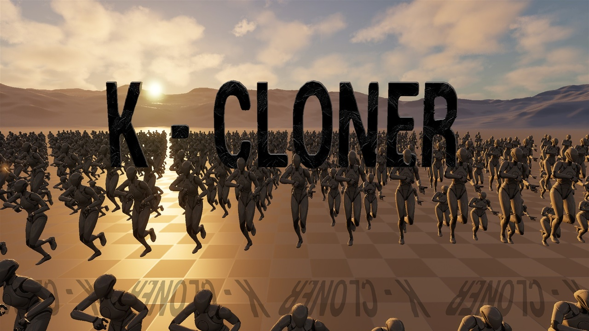

<p align="center">
  
</p>

# K-Cloner

> **Unreal Engine 5.4 – 5.8** | C4D-Style MoGraph, Procedural Instancing & Real-Time Animation Framework for UE5

[](https://fab.com/s/0d51d354f6f8)
[](https://www.youtube.com/watch?v=xuypayM9kwU)
[](Docs/index.md)

K-Cloner brings the flexibility of Cinema 4D-style MoGraph workflows directly into Unreal Engine. It provides a real-time procedural instancing, animation, and effector framework built natively in C++ for both **Static Meshes** and **Skeletal Meshes**.

Whether you need a forest of 10,000 wind-reactive trees, dynamic crowds, procedural weapon sway, impact combat reactions, or generative mathematical structures, K-Cloner handles distribution layouts, modifier stacks, math-driven scripting, and high-performance rendering out of the box.

*Note: This repository has a clean commit history because K-Cloner was previously developed inside a private monorepo. It has now been separated and made public on GitHub.*

---

## Media & Links

- **Documentation:** [Read the Docs](Docs/index.md)
- **Video Demonstration:** [Watch on YouTube](https://www.youtube.com/watch?v=xuypayM9kwU)
- **Fab Marketplace:** [Get K-Cloner on Fab](https://fab.com/s/0d51d354f6f8)

---

## Highlights

### 1. MoGraph on ANY Actor (`UKClonerModifierComponent`)
You are not limited to cloner actors. By attaching `UKClonerModifierComponent` directly onto **any** standard Actor, Character, weapon, or prop, you can apply procedural MoGraph modifier stacks (sway, bounce, wave, noise, K-Script, audio) directly to that entity from the get-go—no cloner actor required.

### 2. Core Distribution & Combinatorial Layouts
Generate complex layouts by stacking multiple distribution layers (e.g. Radial on a Spline, or Hex-grid on a Mesh surface) using the `FKClonerDistributionLayer` architecture:

- **Radial:** Procedural circular distribution with tangential alignment.
- **Linear:** Step-based directional offset accumulation.
- **Spline:** Align to any `USplineComponent` path with tangents and distance offsets.
- **Honeycomb:** Hexagonal grid tessellation.
- **Scatter:** Volume- or box-bounded randomized point scattering.
- **Mesh Surface:** Point sampling via vertices, surface triangles, or mesh volume.
- **Extended Generative Shapes:** Spiral / Helix, Arc / Fan, Sphere / Fibonacci, Cone / Frustum, and Poisson (blue-noise) scatter.
- **Single:** Precise manual placement layer.

### 3. Non-Destructive Modifier Stack & Effectors
Modifiers evaluate in real time and can be stacked, re-ordered, toggled, and blended non-destructively:

- **Audio Reactive:** Uses `AudioSynesthesia` to drive scale, position, rotation, or custom data from live or prerecorded audio spectrums.
- **Texture Sampling:** Sample grayscale textures to drive displacements, rotations, or scale across instances.
- **Organic Motion:** Realistic Wind Sway (multi-frequency sine waves with cross-axis depth) and Perlin/Curl noise fields.
- **Physics Emulation:** Squash-and-stretch Bounce, damped spring Elastic oscillation, and Pendulum swinging.
- **Flow & Propagation:** Wave propagation, Step cascades, and Time Delay (domino effects).
- **Transform Drivers:** Orbit, Float, Pulse, Tumble, and Vortex.
- **Math Curves:** Lissajous curves and Figure-8 paths.
- **Fields & Constraints:** Attract/Repel (with configurable falloff exponents), Explosive Push, Gravity, and Look-At Target constraints (targeting actors or component tags).
- **Inheritance:** Seamlessly morph instance transform matrices between two distinct `AKClonerActor` layouts in the world.

### 4. Hybrid Skeletal & VAT Rendering
Balance visual fidelity and performance when instancing hundreds or thousands of animated characters:

- **Physics / IK Mode:** Full skeletal mesh component evaluation for hero close-ups.
- **VAT / Baked Mode:** Instanced Vertex Animation Textures rendered on an HISM component with zero skeletal CPU overhead.
- **Distance-Based Auto LOD:** Seamlessly transitions from full skeletal evaluation to lightweight VAT rendering based on camera distance thresholds.

### 5. K-Script (Math Expression Engine)
Write custom procedural logic directly in the Details panel using K-Script, powered by the high-performance [ExprTk](https://www.partow.net/programming/exprtk/) library:

```c
// Example: Procedural sine wave with index offset
p.z += sin(t * v0 + i * v1) * v2;
```

- **Variables:** `t` (time), `dt` (delta time), `i` (instance index), `n` (total count), `u` (normalized index 0..1), `seed`, and user-defined slider parameters (`v0`, `v1`, ...).
- **Units:** Built-in scale helpers (`uu`, `cm`, `mm`, `m`, `deg`, `rad`).
- **DataAssets:** Save expressions into `UKClonerModifierPreset` assets with custom slider names and min/max ranges for team libraries.

### 6. External JSON Modifier Preset System (`.kmod.json`)
Author custom modifiers as external JSON files. Modifiers map directly to `UKClonerModifierPreset` and ExprTk expressions with custom slider definitions:
- Place presets in `Content/Modifiers/` to auto-import into `/Game/KCloner/ModifierPresets/`.
- Hot-reload presets at any time from the editor console:
  ```text
  KCloner.ReloadModifiers
  ```

### 7. AnimNotify & Animation Effect Preset System (`.keffect.json`)
Integrate procedural MoGraph layers directly into Skeletal Animation Sequences and Montages:
- **Dedicated Notifies:**
  - `KCloner Modifier`: Instant trigger for a timed procedural effect.
  - `KCloner Modifier State`: Active effect window with automatic blend-out on `NotifyEnd`.
  - `KCloner Distribution`: Spawns a transient distributed cloner burst.
  - `KCloner Distribution State`: Keeps a distributed burst alive for the notify window.
- **JSON Effect Presets (`.keffect.json`):** Configure multi-modifier stacks, blend times, and cloner bursts in JSON. Auto-imported into `/Game/KCloner/AnimationEffects/`.
- Hot-reload effect sources at any time from the editor console:
  ```text
  KCloner.ReloadAnimationEffects
  ```

### 8. Animation Authoring, Baking & Tracer Suite
- **Anim Tweak Mode:** Ingest an existing Skeletal Animation Sequence, apply procedural modifiers/noise on top, and bake the result into a clean new animation asset.
- **Bake to Static Mesh:** Merge thousands of cloner instances into a single optimized `UStaticMesh` with automatic LOD generation, collision, and distance field support.
- **1-Click VAT Generation:** Sample procedural animations into 8-bit, 16-bit, or 32-bit HDR Vertex Animation Textures with automatic Material Instance generation and UV wiring.
- **Tracer System:** `AKClonerTracer` records instance motion histories into real-time `USplineComponent` paths for ribbons, trails, or light streaks.

### 9. Blueprints & C++
Nearly every function, parameter, and distribution property is exposed to Blueprints. The underlying architecture is modular C++ optimized with spatial acceleration (`nanoflann`) and expression compilation (`ExprTk`).

---

## Documentation

Full documentation is available in the [`Docs/`](Docs/index.md) folder:

- [01. Getting Started](Docs/01_getting_started.md)
- [02. Distribution Modes](Docs/02_distribution_modes.md)
- [03. Modifiers & Stacks](Docs/03_modifiers.md)
- [04. Runtime Effectors](Docs/04_effectors.md)
- [05. Skeletal Mesh & VAT Pipeline](Docs/05_skeletal_vat.md)
- [06. Niagara Integration](Docs/06_niagara.md)
- [07. Sequencer Integration](Docs/07_sequencer.md)
- [08. Blueprint API Reference](Docs/08_blueprint_api.md)

---

## Requirements

- **Engine Versions:** Unreal Engine 5.4, 5.5, 5.6, 5.7, 5.8
- **Platform:** Windows (Win64)
- **Engine Plugins:**
  - `Niagara` (Required, enabled by default)
  - `AudioSynesthesia` (Optional, required for audio-reactive modifiers)
  - `GeometryCache` (Optional)

---

## Installation

### Option A: Pre-built Binaries (UE 5.8)
1. Download the pre-built `KCloner-UE5.8-Win64.zip` from the [GitHub Releases](../../releases) page.
2. Extract the `KCloner` folder into your project's `Plugins/` directory:
   ```text
   YourProject/
   └── Plugins/
       └── KCloner/
           ├── KCloner.uplugin
           ├── Binaries/
           ├── Content/
           ├── Resources/
           └── Source/
   ```
3. Open your project in Unreal Engine 5.8. When prompted, enable the plugin and restart.

### Option B: Building from Source (UE 5.4 – 5.8)
1. Clone this repository into your project's `Plugins/` folder:
   ```bash
   cd YourProject/Plugins
   git clone https://github.com/ephemara/KCloner-UE5.git KCloner
   ```
2. If building for UE 5.4 – 5.7, open `KCloner.uplugin` in a text editor and update `"EngineVersion"` to match your installed engine version (e.g. `"5.4.0"`).
3. Regenerate Visual Studio project files (right-click your `.uproject` → **Generate Visual Studio project files**).
4. Build your project in Visual Studio or Rider (Development Editor configuration).

---

## Quick Start

1. **Place a Cloner:** In the Place Actors panel or Content Browser, spawn a `KClonerActor` into your level.
2. **Assign a Mesh:** Select the actor and set your **Static Mesh** or **Skeletal Mesh** under the Cloner settings.
3. **Choose Distribution:** Pick a distribution mode (e.g. `Radial`, `Grid`, or `Spline`) and adjust count and radius.
4. **Add Modifiers:** Under the Modifier Stack, click **Add Modifier** and select `Wave`, `Sway`, `Bounce`, or `Audio`.
5. **Or MoGraph Any Actor:** Add a `UKClonerModifierComponent` directly onto any existing Actor or Character in your level to drive procedural motion on it immediately.
6. **Tweak Sliders:** Adjust frequency, amplitude, and falloff sliders in real time in the viewport.

---

## License

This project is licensed under the MIT License - see the [LICENSE](LICENSE) file for details.
